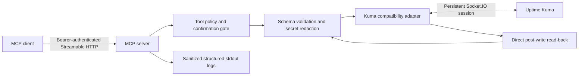

# Proposal 0001: Initial architecture and feature scope

- **Status:** Proposed — not approved for implementation
- **Date:** 2026-08-08
- **Repository:** `plgonzalezrx8/uptime-kuma-mcp`
- **License:** MIT

## 1. Decision requested

Choose whether to build a new safety-first Uptime Kuma MCP, fork an existing implementation, or contribute upstream instead. If a new implementation is approved, also approve the bounded v1 architecture and tool scope below.

No implementation should begin until this proposal is explicitly approved. The canonical Obsidian ADR registry was unreachable while this draft was prepared, so accepted ADR conflict-checking remains a prerequisite before implementation.

## 2. Evidence and constraints

Uptime Kuma exposes two different integration surfaces:

1. Public-purpose HTTP endpoints for push heartbeats, status pages, badges, entry-page data, and Prometheus metrics.
2. An internal authenticated Socket.IO interface used by the web UI for monitor, maintenance, notification, tag, status-page, and settings operations.

Uptime Kuma explicitly warns that the Socket.IO interface is internal, unsupported for third-party compatibility guarantees, and may change without notice. It works, but adapters must be version-aware.

Concrete compatibility evidence:

- Kuma 2.3.2 introduced a required `conditions` field that broke clients omitting it.
- A current third-party MCP had to add missing write fields, secret redaction, session recovery, and read-after-write verification.
- Bulk pause/resume traffic has exhausted a Kuma MariaDB pool in the field.
- As of this proposal, Uptime Kuma's latest release is 2.5.0.

There are already multiple MIT-licensed MCPs. `DavidFuchs/mcp-uptime-kuma` is active, supports Kuma v2, Docker, stdio and Streamable HTTP, and has a real contributor base. A generic clone would add little value.

## 3. Product options

### Option A — New clean-room safety-first MCP

Build a narrow TypeScript adapter directly against Kuma's Socket.IO contract.

**Benefits**
- Full control over safety defaults and compatibility policy.
- No inherited credential-exposure behavior or broad tool surface.
- Clear identity as an operations-safe MCP rather than a full-control demo.

**Costs**
- Highest maintenance burden.
- Duplicates mature upstream work.
- Requires ongoing testing for every supported Kuma release.

### Option B — Fork the active `DavidFuchs/mcp-uptime-kuma` project

Retain MIT attribution, then add stricter defaults, policy gates, Compose hardening, and compatibility certification.

**Benefits**
- Fastest path to broad working functionality.
- Starts from an active v2 implementation with integration tests.

**Costs**
- Ongoing upstream merge burden.
- Repository identity becomes derivative.
- Existing architecture may constrain stronger safety boundaries.
- Converting the current independent repository into a true GitHub fork would require deleting/recreating it, which is not authorized by this proposal.

### Option C — Contribute upstream and keep no competing implementation

Contribute safety, verification, and compatibility improvements to the active project.

**Benefits**
- Least duplication and strongest community impact.
- Lowest long-term maintenance burden.

**Costs**
- Less product control and no independent tool under this account.
- Upstream may reject opinionated defaults.

### Recommendation

**Recommend Option A only if the safety policy itself is the product. Otherwise choose Option C.** Building another broad, undifferentiated Kuma MCP would be wasted effort.

The remainder of this proposal describes Option A.

## 4. Proposed v1 architecture

### Runtime

- TypeScript on a current Node.js LTS runtime.
- Official MCP TypeScript SDK.
- `socket.io-client` for Kuma's internal management interface.
- One persistent Socket.IO connection to one Kuma instance in v1.
- Stateless service: no application database and no credential persistence.
- Streamable HTTP at `/mcp`; minimal unauthenticated liveness at `/health` with no Kuma details.
- Stdio may be added later, but Docker Compose plus Streamable HTTP is the default and first release gate.

### Authentication

- Kuma: JWT or username/password; API keys are insufficient for Socket.IO management.
- MCP endpoint: bearer token required by default.
- Compose publishes only to `127.0.0.1` by default. Remote exposure requires an explicitly configured trusted reverse proxy and TLS.
- Configuration uses environment variables declared in Compose and a committed `.env.example`; no Infisical integration.

### Docker posture

- Multi-stage build.
- Non-root runtime user.
- Read-only root filesystem, `cap_drop: [ALL]`, `no-new-privileges`, and `tmpfs` for temporary files.
- Healthcheck, graceful shutdown, bounded reconnect backoff, and pinned image versions.
- GHCR publishing after release automation is approved.

## 5. Safety model

### Defaults

- Read-only mode is the default.
- Writes require `ENABLE_WRITES=true`.
- Destructive tools require both `ENABLE_DESTRUCTIVE=true` and `confirm: true` in the tool call.
- Unknown tool fields fail loudly; they are never silently dropped.
- Mutations are serialized per Kuma instance and rate-limited.

### Mandatory redaction

Never return or log:

- `basic_auth_pass`, bearer tokens, push tokens, custom authorization headers;
- database connection strings or credentials;
- Docker host credentials or certificates;
- notification provider configuration secrets;
- Kuma password, JWT, MCP bearer token, or session material.

Sensitive fields are removed at the adapter boundary before they can enter MCP results, errors, or logs. There is no `include_sensitive` escape hatch.

### Mutation verification

Every write follows this sequence:

1. Validate input against the supported Kuma-version schema.
2. Read and sanitize the current object when one exists.
3. Emit the Socket.IO mutation and inspect the application callback.
4. Read directly from Kuma again rather than trusting a possibly stale event cache.
5. Compare safety-relevant requested fields with persisted fields.
6. Return a sanitized before/after diff and verification result.

A callback containing `ok: true` is not considered proof that all fields persisted.

## 6. Proposed feature roadmap

### Phase 0 — Contract and security harness

No public write tools yet.

- Detect Kuma version and authentication mode.
- Capture sanitized schemas for initial Socket.IO events.
- Build disposable-fixture contract tests against pinned Kuma containers.
- Define the redaction corpus and leak tests.
- Document the supported-version matrix.

### Phase 1 — Read-only MVP

Proposed tools:

| Tool | Purpose |
|---|---|
| `kuma_get_instance_info` | Version, connection state, server timezone, and supported capability flags |
| `kuma_get_monitor_summary` | Context-efficient counts and current states, including heartbeat age |
| `kuma_list_monitors` | Filtered, paginated, redacted monitor inventory |
| `kuma_get_monitor` | Redacted monitor configuration and current state |
| `kuma_get_heartbeats` | Bounded heartbeat history with explicit ordering and freshness |
| `kuma_get_chart_data` | Bounded aggregate uptime/ping data |
| `kuma_list_tags` | Tag inventory |
| `kuma_list_maintenance` | Maintenance windows |
| `kuma_list_status_pages` | Status-page metadata |
| `kuma_list_notifications` | Provider names/types only; secret configuration withheld |

Success gate: no known secret reaches any tool result; all schemas pass against the supported Kuma matrix.

### Phase 2 — Guarded monitor writes

- `kuma_create_monitor`
- `kuma_update_monitor`
- `kuma_pause_monitor`
- `kuma_resume_monitor`

Initial monitor types: HTTP(S), keyword, JSON query, ping, TCP port, DNS, and push. Other types wait for explicit schemas and fixtures.

Success gate: every supported field has a persistence test and every mutation returns read-back evidence.

### Phase 3 — Maintenance and status operations

- Create, update, pause/resume, and delete maintenance windows.
- Post/update/unpin status-page incidents.
- Create/update status pages only after full read-back tests exist.

Prefer maintenance windows over bulk monitor pausing.

### Phase 4 — Optional expansion

- Multiple Kuma instances.
- Additional monitor types.
- Stdio transport.
- MCP resources/subscriptions for live status changes.
- Notification creation/testing only after provider-specific secret schemas and outbound-message safeguards exist.

## 7. Explicit v1 non-goals

- User, password, 2FA, or authentication-setting management.
- API-key management.
- Database migration, backup, restore, or administrative repair.
- Arbitrary Socket.IO event passthrough.
- Returning full notification configurations.
- Bulk unbounded mutations.
- Automatic Kuma upgrades.
- Compatibility claims for untested Kuma versions.

## 8. Compatibility policy

- Target Kuma 2.5.0 first.
- Add another version only after its full contract suite passes.
- Unknown major versions fail closed for write tools.
- Untested minor versions expose reads with a warning but disable writes by default.
- Every release publishes a matrix of MCP version to tested Kuma versions.
- CI tests at least the minimum and latest supported Kuma versions using disposable containers.

## 9. Verification and release gates

- Unit tests for schemas, redaction, policies, rate limits, and reconnect behavior.
- Integration tests against real disposable Kuma containers.
- Controlled create/read/update/read/delete fixture lifecycle with cleanup verification.
- Tests proving known secrets cannot appear in results, logs, snapshots, or thrown errors.
- MCP protocol tests for initialize, tools/list, valid calls, invalid calls, and session shutdown.
- Docker Compose smoke test from a clean checkout.
- Dependency, container, and secret scanning in CI.
- No `latest` tag until a versioned release passes all gates.

## 10. Approval questions

1. Choose Option A (new), B (fork), or C (upstream contribution).
2. If Option A: approve TypeScript + official MCP SDK + direct Socket.IO adapter?
3. Approve single-instance, read-only-first v1 rather than broad full control?
4. Approve bearer-authenticated Streamable HTTP bound to localhost by default?
5. Approve destructive tools being disabled until a later phase?

## Sources

- [Uptime Kuma Internal API](https://github.com/louislam/uptime-kuma/wiki/Internal-API)
- [Uptime Kuma 2.5.0 release](https://github.com/louislam/uptime-kuma/releases/tag/2.5.0)
- [Kuma conditions compatibility regression](https://github.com/louislam/uptime-kuma/pull/7484)
- [Bulk Socket.IO mutation database-pool issue](https://github.com/louislam/uptime-kuma/issues/6855)
- [Active existing MCP](https://github.com/DavidFuchs/mcp-uptime-kuma)
- [Existing MCP v0.11.0 security and hardening release](https://github.com/DavidFuchs/mcp-uptime-kuma/releases/tag/v0.11.0)
